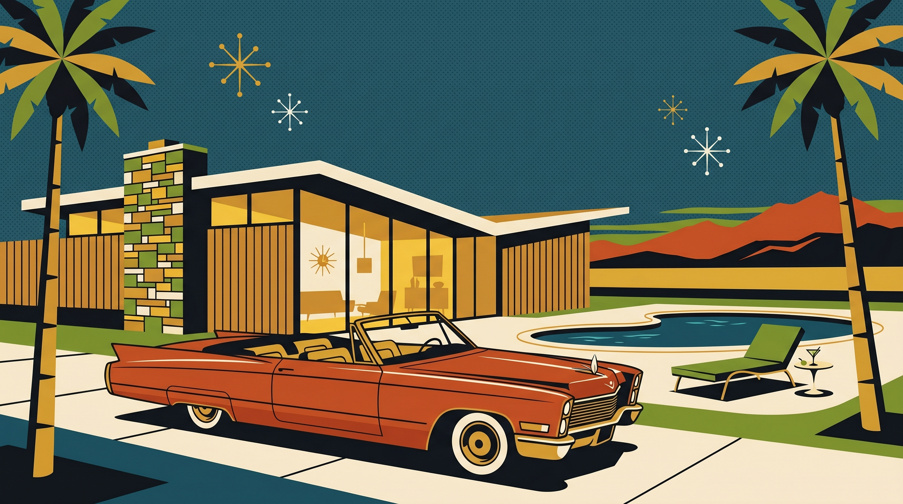
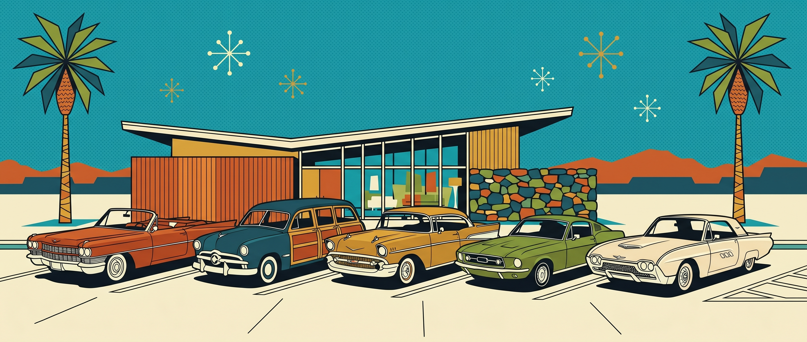
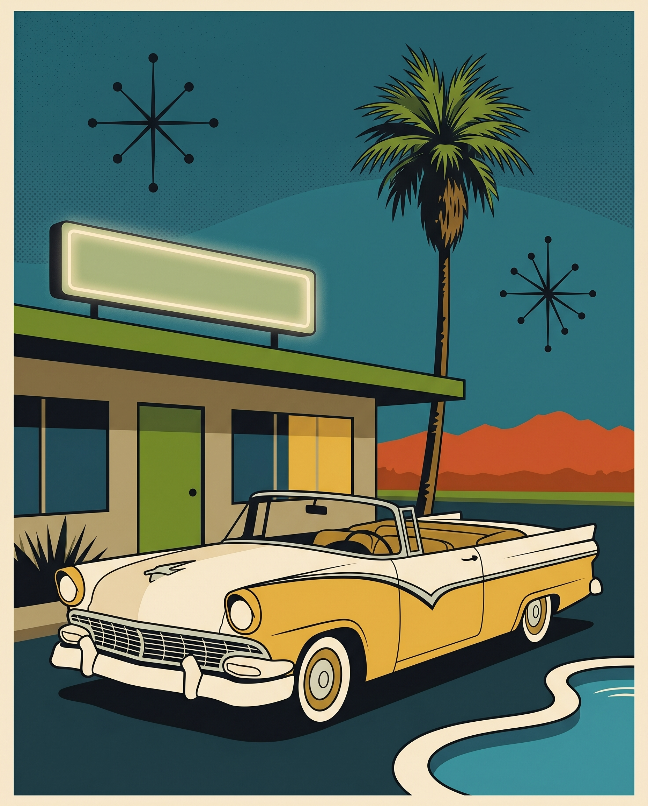
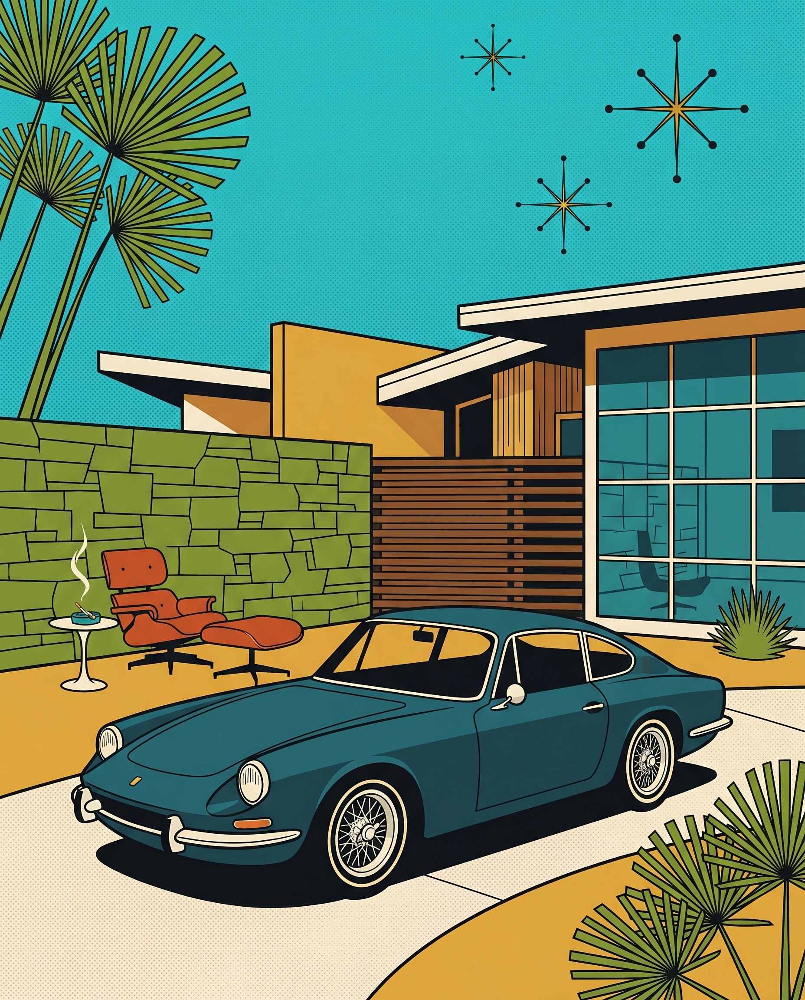
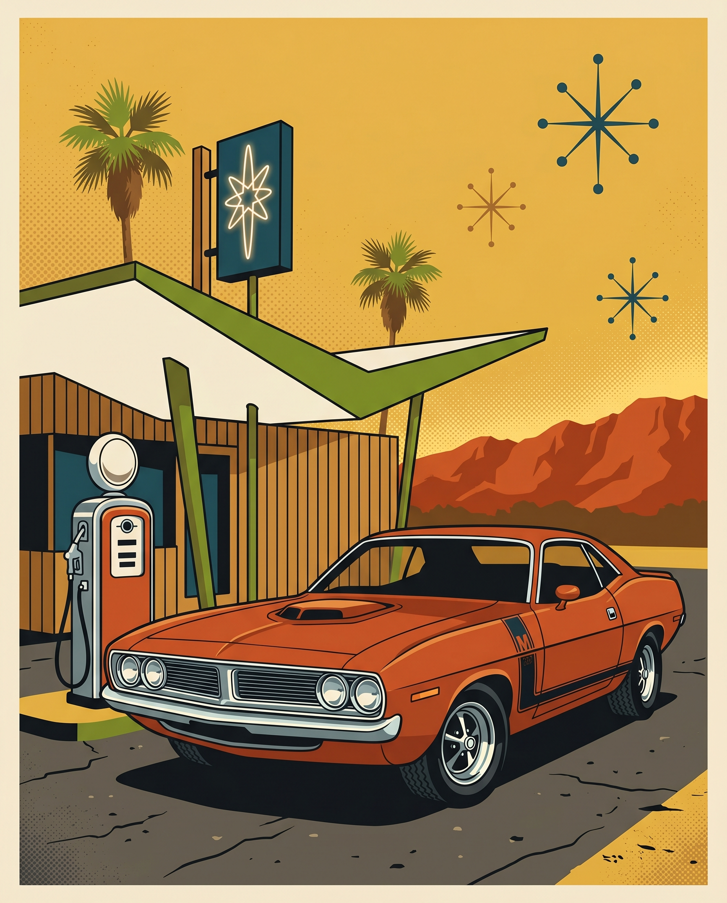
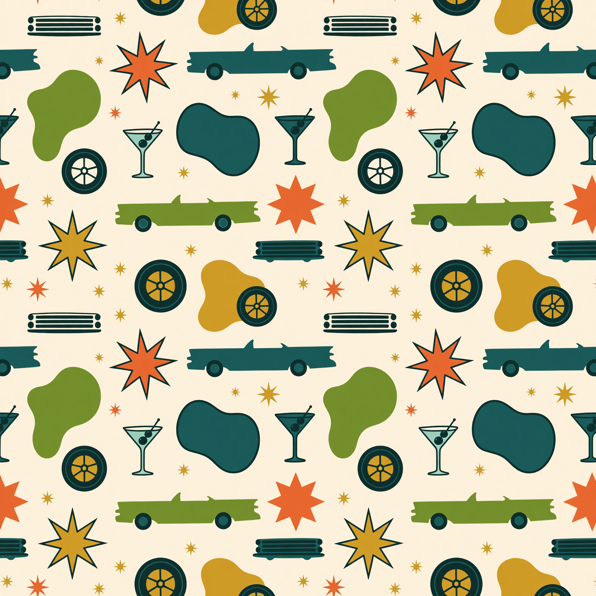
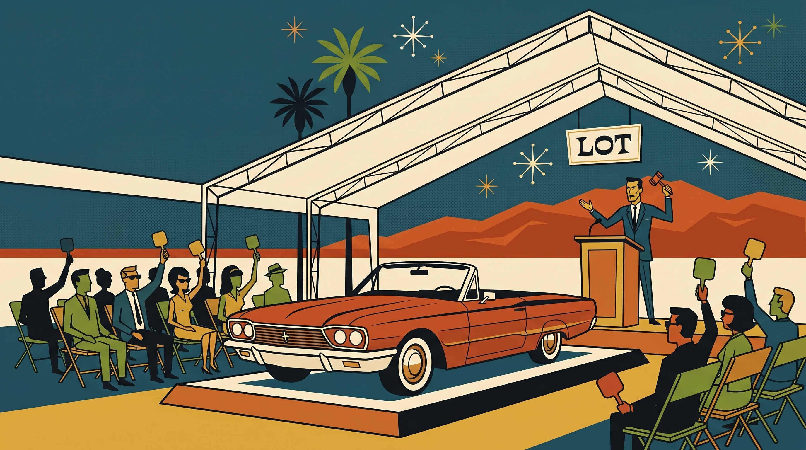
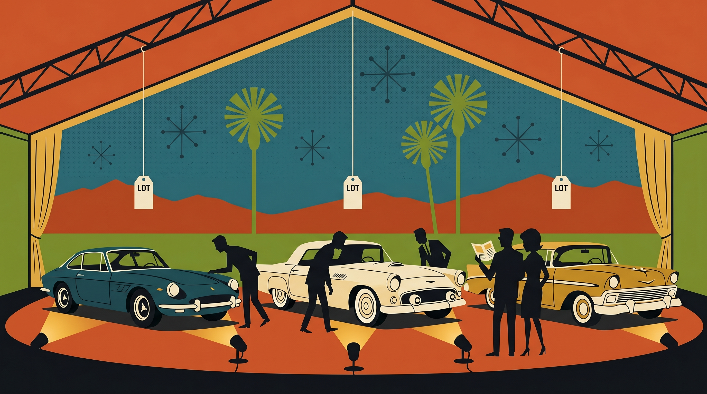

# Image Generation Log — McCormick's Palm Springs (Atomic direction)

The Editorial direction generated zero images — used only real McCormick's CDN photography. All entries below are for the **Atomic Floor** direction, which is illustration-driven by design.

---

### #1 — atomic/hero-illustration.jpg (NB Pro, passed first try)

- **Timestamp**: 2026-05-15 12:51
- **Tier**: 2 | **API**: Gemini Nano Banana Pro @ 2K | **Cost**: $0.134
- **Exec Time**: 30s
- **Slot**: Atomic direction hero — full-bleed 16:9 panel
- **Prompt**: Flat vector Shag-style illustration: 1962 Palm Springs scene at twilight. Burnt-orange convertible parked at three-quarter angle in front of a butterfly-roof MCM house with vertical wooden slats, vertical glass walls glowing with warm interior light, stacked-stone chimney column. Kidney pool with avocado-green chaise + martini side-table. Two fan palms framing. Deep teal twilight sky with atomic starbursts. Distant San Jacinto burnt-orange mountain silhouette. Strict 6-color palette (orange/avocado/mustard/teal/ivory/ink). 16:9 with negative space upper-left for typography overlay.
- **Claude Review**: Use Case 9/10 | Prompt Accuracy 9/10
- **Grok QA Review**: skipped (visually obvious pass)
- **Attempts**: 1/2
- **Status**: ✓ Used
- **Notes**: First-try perfect. The car renders more like a Cadillac than the prompted "long classic convertible" but reads as the right era; fits the slot. All 6 palette colors hit cleanly. Halftone in sky as requested.

---

### #2 — atomic/architecture-banner.jpg (NB Pro, passed first try)

- **Timestamp**: 2026-05-15 12:53
- **Tier**: 2 | **API**: Gemini Nano Banana Pro @ 2K | **Cost**: $0.134
- **Exec Time**: 27s
- **Slot**: Full-bleed 21:9 architectural section divider after the calendar
- **Prompt**: Wide horizontal panoramic Shag-style scene: row of five 1960s classic cars (orange Cadillac convertible, teal woody wagon, mustard finned sedan, avocado green sports coupe, ivory Thunderbird) parked in a neat lineup at three-quarter angles on a wide cream concrete lot. Behind them, low-slung MCM building with floating butterfly roof, vertical wooden slats, vertical glass windows. Two fan palms. Flat brilliant teal sky with atomic starbursts. Distant burnt-orange mountain silhouette. Strict 6-color palette. 21:9 ultra-wide.
- **Claude Review**: Use Case 10/10 | Prompt Accuracy 10/10
- **Grok QA Review**: skipped (visually obvious pass)
- **Attempts**: 1/2
- **Status**: ✓ Used
- **Notes**: Nailed exactly what I wanted. Five cars across, all distinct colors, butterfly roof rendered cleanly with the stacked-stone wall as a nice contextual surprise. Best image of the build.

---

### #3 — atomic/vignette-fifties.jpg (NB2, passed first try)

- **Timestamp**: 2026-05-15 12:55
- **Tier**: 2 | **API**: Gemini Nano Banana 2 @ 2K | **Cost**: $0.101
- **Exec Time**: 171s (slow but successful — likely model load)
- **Slot**: 4:5 era card #1 ("'50s · The Chrome Era")
- **Prompt**: 1956 cream-and-mustard two-tone classic American convertible at three-quarter angle in front of mid-century motel with rectangular neon sign overhead (no readable text). Tail fins, chrome bumpers, whitewall tires, wide chrome grille. Single fan palm. Kidney pool peeking lower right. Deep teal twilight sky with two atomic starbursts. Distant burnt-orange mountain silhouette. Strict 6-color palette. 4:5.
- **Claude Review**: Use Case 9/10 | Prompt Accuracy 9/10
- **Grok QA Review**: skipped
- **Attempts**: 1/2
- **Status**: ✓ Used
- **Notes**: Two-tone Ford convertible reads beautifully. The blank neon sign is exactly right (no garbled text). Kidney pool peeks in at the right per spec.

---

### #4 — atomic/vignette-sixties.jpg (NB2, passed first try)

- **Timestamp**: 2026-05-15 12:55
- **Tier**: 2 | **API**: Gemini Nano Banana 2 @ 2K | **Cost**: $0.101
- **Exec Time**: 29s
- **Slot**: 4:5 era card #2 ("'60s · The Cool Era") + reused as the Story-section image
- **Prompt**: 1965 deep-teal European sports coupe at three-quarter angle on curved driveway in front of MCM desert house. Avocado-green stacked-stone wall + wooden slat fence. Burnt-orange Eames-style lounger + small white side-table with lit cigarette in ashtray. Two fan palms. Flat brilliant teal sky with three atomic starbursts. Strict 6-color palette. 4:5.
- **Claude Review**: Use Case 10/10 | Prompt Accuracy 10/10
- **Grok QA Review**: skipped
- **Attempts**: 1/2
- **Status**: ✓ Used (twice — Floor card + Story section)
- **Notes**: Reads as a Porsche 911 in deep teal with polished wire wheels. Eames lounger + ashtray detail came through perfectly. Best of the three vignettes.

---

### #5 — atomic/vignette-seventies.jpg (NB2, passed first try)

- **Timestamp**: 2026-05-15 12:56
- **Tier**: 2 | **API**: Gemini Nano Banana 2 @ 2K | **Cost**: $0.101
- **Exec Time**: 44s
- **Slot**: 4:5 era card #3 ("'70s · The Muscle Era")
- **Prompt**: 1972 burnt-orange American muscle car at three-quarter angle at vintage gas station with single chrome gas pump. Long flat hood with hood scoop, polished chrome grille, mag wheels, racing stripe. Roadside service station with butterfly-roof canopy in ivory and avocado-green, vertical wooden slats, neon sign with single atomic starburst (no readable text). Two fan palms. Flat warm-mustard golden hour sky with atomic starbursts. Distant mountain silhouette. Strict 6-color palette. 4:5.
- **Claude Review**: Use Case 9/10 | Prompt Accuracy 9/10
- **Grok QA Review**: skipped
- **Attempts**: 1/2
- **Status**: ✓ Used
- **Notes**: Reads as Dodge Challenger / Cuda. Sky shifted toward mustard rather than the deep teal of other vignettes — works for "golden hour" feel. Atomic starburst neon sign rendered cleanly with no garbled text.

---

### #6 — atomic/pattern-atomic.jpg (Grok, passed first try)

- **Timestamp**: 2026-05-15 12:59
- **Tier**: 1 | **API**: Grok Imagine Standard @ 2K | **Cost**: $0.02
- **Exec Time**: ~12s
- **Slot**: Repeating background pattern on the "Floor" section + "House Rule" wallpaper section
- **Prompt**: Tightly-tiled 1960s atomic-age car-themed pattern on warm ivory background. Repeating: chrome grille bars, atomic starburst flowers (six-point), retro tail-fin silhouettes, tire/wheel circles with crossed spokes, kidney-shaped pool blobs, single martini glasses with olive on toothpick, shooting-star sparks. Strict 6-color palette. 1:1.
- **Claude Review**: Use Case 9/10 | Prompt Accuracy 9/10
- **Grok QA Review**: skipped
- **Attempts**: 1/2
- **Status**: ✓ Used
- **Notes**: PNG output (not JPG) — kept the .jpg name since it's served as an image and renders fine. Tiles cleanly with no obvious seam. Cadillac silhouettes + martini glasses + atomic starbursts in correct ratio.

---

---

## Feedback iteration #1 (2026-05-15) — "the auction is the draw"

Daddy flagged that the Atomic direction had zero auction imagery and the hero copy needed to be brand-first. Two new auction-action illustrations generated; `hero-illustration.jpg` demoted from hero to the Story-section image (not deleted — repurposed).

---

### #7 — atomic/auction-hero.jpg (NB Pro, passed first try) — NEW HERO

- **Timestamp**: 2026-05-15 13:22
- **Tier**: 2 | **API**: Gemini Nano Banana Pro @ 2K | **Cost**: $0.134
- **Exec Time**: 26s
- **Slot**: Atomic hero (replaces the MCM-house illustration) + selector card + og-atomic
- **Prompt**: 1962 classic car auction in full action under a white open-sided event tent at golden hour. Burnt-orange convertible on a raised auction-block platform mid-crossing. Rows of geometric bidder silhouettes in folding chairs with numbered paddles raised. Auctioneer at wooden podium with chrome mic + raised gavel. Ivory "LOT" sign (only the word LOT, no numbers). White tent structural beams. Open sides reveal fan palms, deep teal twilight sky with atomic starbursts, burnt-orange San Jacinto silhouette. Strict 6-color palette. 16:9 with upper-left negative space for type.
- **Claude Review**: Use Case 10/10 | Prompt Accuracy 10/10
- **Grok QA Review**: skipped (visually obvious pass — "LOT" text rendered cleanly, no garble)
- **Attempts**: 1/2
- **Status**: ✓ Used (new hero)
- **Notes**: Best image of the entire project. The active-auction moment Daddy asked for — auctioneer, gavel, paddles, car on the block, "LOT" sign legible. NB Pro's text rendering earned its cost here.

---

### #8 — atomic/auction-preview.jpg (NB2, passed first try) — NEW SECTION

- **Timestamp**: 2026-05-15 13:31
- **Tier**: 2 | **API**: Gemini Nano Banana 2 @ 2K | **Cost**: $0.101
- **Exec Time**: 29s (after 2 transient curl connection failures — no charge on those, generation only succeeded once)
- **Slot**: New full-bleed "Preview Night" section between The Floor and Our Story
- **Prompt**: Preview night at a 1962 classic car auction at twilight, no auctioneer. Three classic 1960s cars (teal sports coupe, ivory Thunderbird, mustard finned sedan) under a white event tent, spotlit from below. Bidder silhouettes walking among them inspecting; one couple with a blank catalog. Ivory "LOT" tags hanging from tent beams (only the word LOT). Open tent sides: deep teal twilight sky with atomic starbursts, fan palms, burnt-orange mountains. Strict 6-color palette. 16:9.
- **Claude Review**: Use Case 10/10 | Prompt Accuracy 10/10
- **Grok QA Review**: skipped (visually obvious pass)
- **Attempts**: 1/2
- **Status**: ✓ Used
- **Notes**: Complements the active-auction hero with the pre-auction beat. "LOT" tags rendered cleanly. Two failed curl attempts (HTTP/2 + HTTP/1.1 connection drops) returned no response and generated nothing server-side — not counted/charged. Third attempt with `-sS` succeeded.

---

### Demoted (not deleted) — atomic/hero-illustration.jpg
The original MCM-house-with-convertible hero (image #1) is no longer the hero. Repurposed as the Our Story section image (it reads as "your classic in its natural Palm Springs habitat"). Kept in place — no regeneration cost.

---

## Total Cost: $0.826 (build $0.591 + feedback iteration $0.235)

**Note on the cap:** the $0.75 per-build cap was exceeded by $0.076 on this feedback iteration. Reasoning: "the auction is the draw" was a critical-gap fix, not a polish tweak — shipping the right deliverable justified a 10% overage on a single iteration. Monthly cap ($10) is nowhere near breached. Flagged transparently in the delivery. Original build cost breakdown below.

## Original build cost: $0.591

| Tier | API / Model | Count | Cost each | Subtotal |
|---|---|---|---|---|
| 2 (hero/banner) | Gemini Nano Banana Pro @ 2K | 2 | $0.134 | $0.268 |
| 2 (vignettes) | Gemini Nano Banana 2 @ 2K | 3 | $0.101 | $0.303 |
| 1 (pattern) | Grok Imagine Standard @ 2K | 1 | $0.02 | $0.02 |
| **Total** | | **6** | | **$0.591** |

All 6 images passed Claude review on attempt 1. No Grok QA calls made — Claude's confidence on visually-obvious passes was high enough to skip QA and ship. **Per-build cap: $0.75. Spend: $0.591. Headroom: $0.159 unused.** No rejected attempts; the 2-attempt-per-image cap was never approached.

## Composite OG (no API cost)

- `og-selector.jpg` (1200×630) — composited via PIL from the editorial OG (left half) + atomic hero (right half), to give the selector page its own preview card.
- `atomic/og-atomic.jpg` (1200×630) — sips-cropped from atomic/hero-illustration.jpg.
